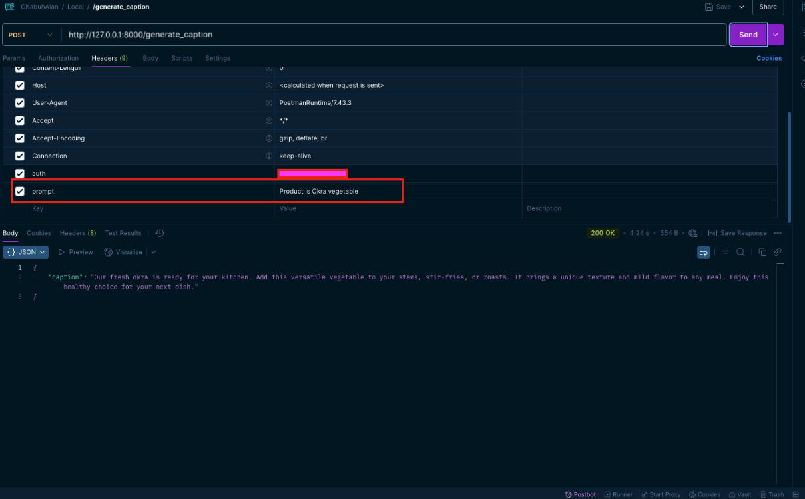
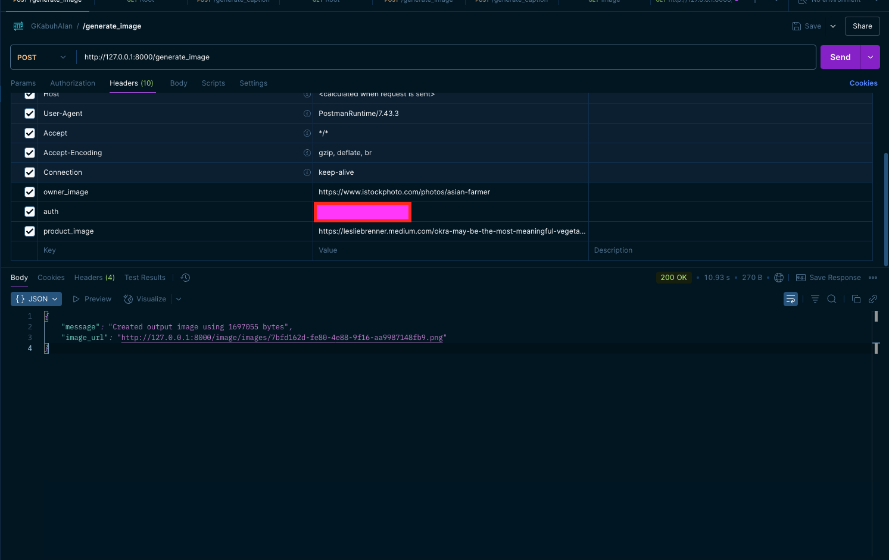
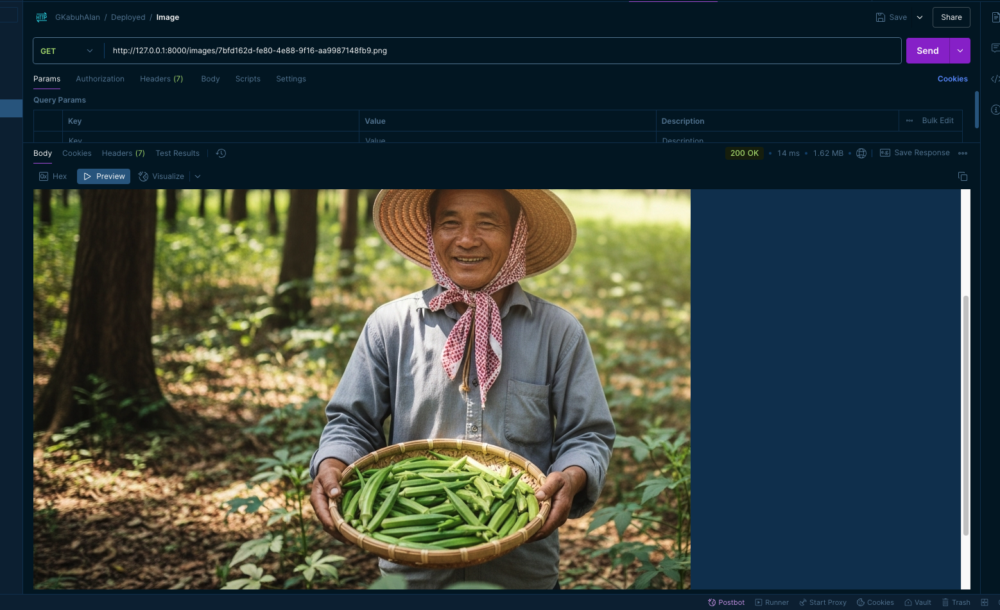

# GKabuhAIan-API-AliCloud

## Overview

This API powers the GKabuhAIan platform's AI features, enabling caption generation and AI image creation for the React Expo frontend application. It serves as the backend for the Marketing Toolkit, connecting to AliCloud's Elastic Algorithm Service for AI capabilities.

## Features

### Caption Generation
- Uses QWEN AI model through AliCloud EAS
- Generates marketing text for merchant products
- Optimized for social media content

### AI Image Generation
- Uses AliCloud AI Painting service
- Combines merchant photos with product images
- Creates professional social media-ready visuals

## Technical Architecture

The API is built with FastAPI and connects to two AliCloud services:
- **QWEN**: For text caption generation
- **AI Painting**: For image generation and manipulation

## API Endpoints

### `/generate_caption`
- **Method**: POST
- **Description**: Generates marketing text based on provided prompt
- **Authentication**: Required via header
- **Parameters**: 
  - `prompt` (header): Text description of what to generate
  - `auth` (header): Authentication token



### `/generate_image`
- **Method**: POST
- **Description**: Creates composite images of merchants with their products
- **Authentication**: Required via header
- **Parameters**:
  - `owner_image` (header): URL to merchant image
  - `product_image` (header): URL to product image
  - `auth` (header): Authentication token



### `/get_tmp_image/{filename}`
- **Method**: GET
- **Description**: Retrieves generated images
- **Parameters**:
  - `filename` (path): Image filename to retrieve



## Setup

1. Clone the repository
```bash
git clone https://github.com/your-username/GKabuhAIan-API-AliCloud.git
cd GKabuhAIan-API-AliCloud
```

2. Install dependencies
```bash
pip install -r requirements.txt
```

3. Create a `.env` file with your AliCloud credentials
```
EAS_ENDPOINT=your_eas_endpoint
EAS_TOKEN=your_eas_token
ALI_CLOUD_ENDPOINT=your_alicloud_endpoint
ALI_CLOUD_TOKEN=your_alicloud_token
```

4. Run the API
```bash
uvicorn main:app --reload
```

## Integration with GKabuhAIan Frontend

This API is consumed by the GKabuhAIan React Expo application to power its Marketing Toolkit features, enabling merchants to easily create professional marketing materials without technical skills.
